# 概要
いままではぷよを一つしか落とせませんでした。
ぷよが下に着いたら、新しいぷよがでるようにしましょう。

https://user-images.githubusercontent.com/936545/153456542-61d4d407-545d-417e-959a-90192a3d8930.mp4

# 手順
## 新たに落とす人を導入
### ランダムにぷよの色を決める
今まで、決め打ちでぷよの色を決めていましたが、ここで乱数を使って落ちるぷよの色を変えてみましょう。

ぷよぷよは2つのぷよが1セットとなって落ちてきます。したがって、ぷよぷよの色も2つづつ管理するのがよさそうです。
また、ぷよぷよでは、次に落ちてくるぷよ(NEXTぷよ)の色を確認することができます。
NEXTぷよは、2つ先のぷよまで見れますが、これらは次々に押し出されてくる形なので、
Queueで管理するのが良さそうです。

C#の文法としては、２つのデータを管理するためのコンテナとして、Tupleがありますが、
汎用的で文法で冗長なため、今回は、Unity側が定義しているVector2IntでNEXTぷよの種類を管理したいと思います。
このNEXTぷよを管理するためのクラスとして、ここではNextQueueというクラスを作成してみます。
NextQueueという名前で、C#スクリプトを追加してください。
このクラスは、MonoBehaviorの派生である必要はないので、生成したら、基底クラスの情報を削除して、シンプルなクラス宣言にしてみます(6行目)。

乱数の生成には、UnityEngineにRandom クラスが用意されているので、こちらを使ってみましょう(19,20行目)。
このクラスはRangeメソッドで最小値と、最大値の次の数を指定して乱数を得ます。
今回は、[0,PUTO_TYPE_MAX-1]までの乱数を得て、その値に１を足していますが、「Range(1､(int)Constants.PUTO_TYPE_MAX+1)」でも、同じ値が得られます。
System.Random というクラスもあるので、using を使う場合は、両方のクラスを指さないようにしましょう。
具体的には、「using System;」を追加する際は、Randon.Rangeを「UnityEngine.Range」等に変更する必要があります。

あとは、初期化時に管理する個数(今回は、PUYO_NEXT_HISTORYの2個)だけキューの要素を詰めておいて(23-30行目)、
次のぷよの色を取得する際は、Dequeueで先頭の要素を取り出しつつ、Enqueueで次の要素を格納して、数を保つようにしています(32-39行目)。

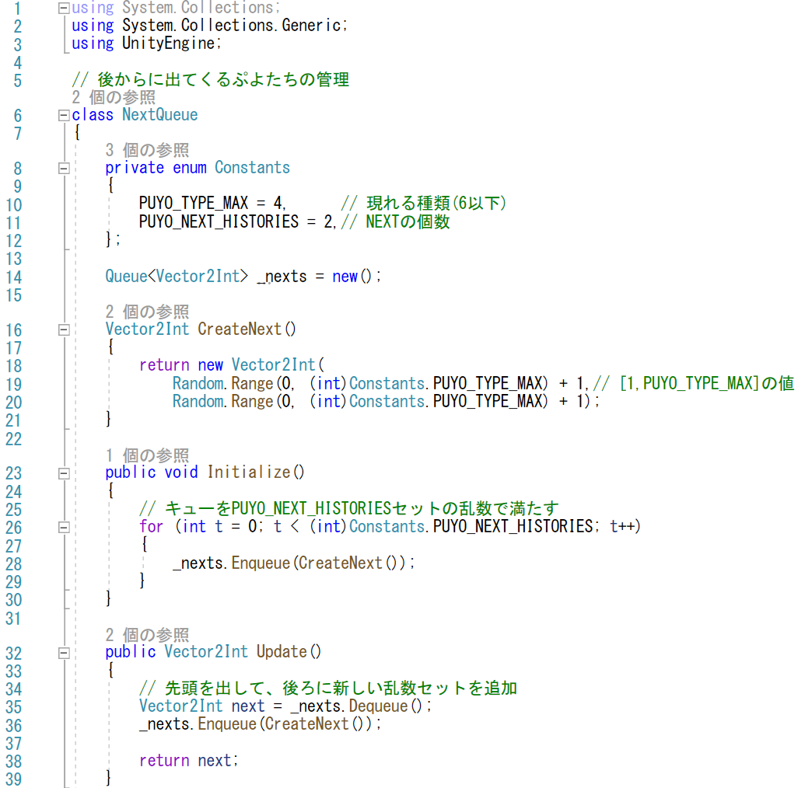

### 監督者の導入

このNextQueueを使って、新しいぷよを生み出すコードを追加していきます。

NextQueueを出すという処理はゲームの流れであるゲームループの処理の一部分であると考えられます。
そのため、ゲームの流れを管理するスクリプトを導入します。
この「流れ」は、対戦モードなどを考えた場合、一人のプレイヤーのゲームの流れを管理するものと考えられます。
したがって、今回は、「PlayDirector」という名前のスクリプトを追加してみます。
このオブジェクトを付けるゲームオブジェクトはゲーム中に一つの物であればなんでもよいのですが、
自然な流れとしては、「Board」ゲームオブジェクトに付けるのがよいでしょう。

PlayDirectorが行うことですが、最初にぷよをだして、そのあと、ぷよが固定されるたびに
新しいものを出していきます。
ぷよの操作自体は「PlayerController」が行うので、ぷよを出すたびにPlayerのゲームオブジェクトを生成すれば良いように思います。
しかし、実はそれは良くありません。ぷよぷよでは、次のぷよが落ちてくる前にキーを左右に入れておくと、
ぷよは出てきたときにすぐに移動できるようになっています。
つまり、Playerのゲームオブジェクトに入力処理を任せておくと、その前に入れっぱなしの処理に対応することができないので、
ぷよが落ちてくるたびにPlayerのゲームオブジェクトを作り出すのはよろしくない作り方になります。
したがって、今回は、PlayerController はあらかじめ用意しておいて、
ぷよが固定された際に、PlayerControllerに新たなぷよの種類を伝えることにします。

PlayDirectorは、次のメンバーを持つことになります。

- プレイヤーのゲームオブジェクト (7行目)
- PlayerController (8行目)
- NextQueue (11行目) 

プレイヤーのゲームオブジェクトは必須ではないのですが、ぷよが固定された際に、プレイヤーのActiveをfalseにする処理を
していたので、その処理を流用すると次にぷよを出すべきか判定できるため、ゲームオブジェクトを保持してみました。
PlayerController で、次のぷよを出すかどうかを判定するのも良いでしょう。

PlayDirector のインターフェイスは、初期化のStartと固定フレームレートでゲームロジックを更新するFixedUpdateになります。
Startでは、次の処理を行います。

- PlayerControllerを取得する (17行目)
- NEXTぷよの乱数を初期化する(21行目)
- 最初のぷよを出す(22行目)

PlayerControllerの取得は、SerialisedFieldを使ってインスペクターで設定する方法も取れますが、
今回は、ゲームオブジェクトも同時に保持するため、２つ同じものを設定するのは煩雑と考え、GetComponentで
PlayerControllerを獲得するようにしてみました。

ぷよを出すSpawn処理は、PlayDirector のprivateなメソッドとして抜き出しています(73行目)。
このSpawn処理は、PlayerControllerのメソッドを呼び出すだけの実装にしたので、一行のシンプルなラムダ式にしてみました。

毎フレームでの更新では、プレイヤーがアクティブかどうかを調べて、（ぷよを固定させて）アクティブでなくなったら、
新たなぷよを生み出すことにします(66-70行目)。

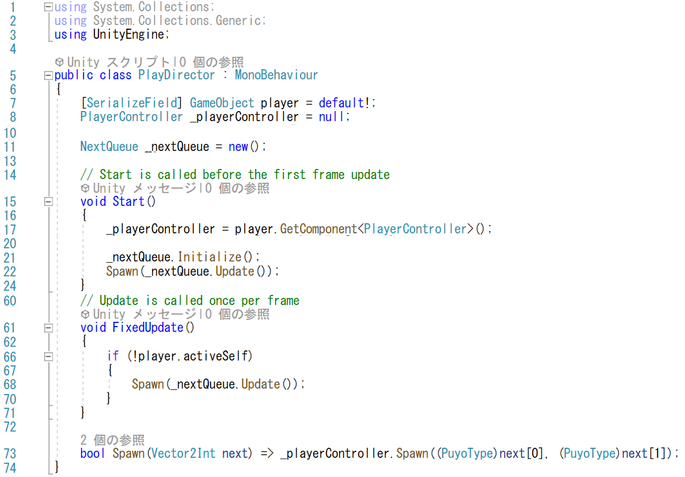

### プレイヤーの初期化処理の変更 (PlayerController.cs)

PlayDirector を作成したら、PlayerControllerをPlayDirector とつなぎ合わせなくてはなりません。
今までPlayerControllerで行っていた初期化処理を、PlayDirector のSpawn呼び出しで呼ばれた際の
処理に置き換えます。具体的には、PlayerControllerにSpawn メソッドを追加して、
Spawn メソッドに今までStartメソッドに記載していた初期化処理を移します。
なお、変数宣言で初期化しているメソッドもありますが、これらはぷよを新しく出すときに
再設定しなくてはならないので、初期化コードをSpawnメソッドに追加します(57-67行目)。

また、ぷよを出現させようとした際に、その場所にすでにぷよが置かれていればゲームオーバーになるので、
Spawnメソッドの返り値にゲームオーバーになったかどうかの判定を入れるのがきれいそうです(60行目)。

Start処理では、PlayDirector に初期化をゆだねるために非Activeの状態にしておくことにします(46行目)。

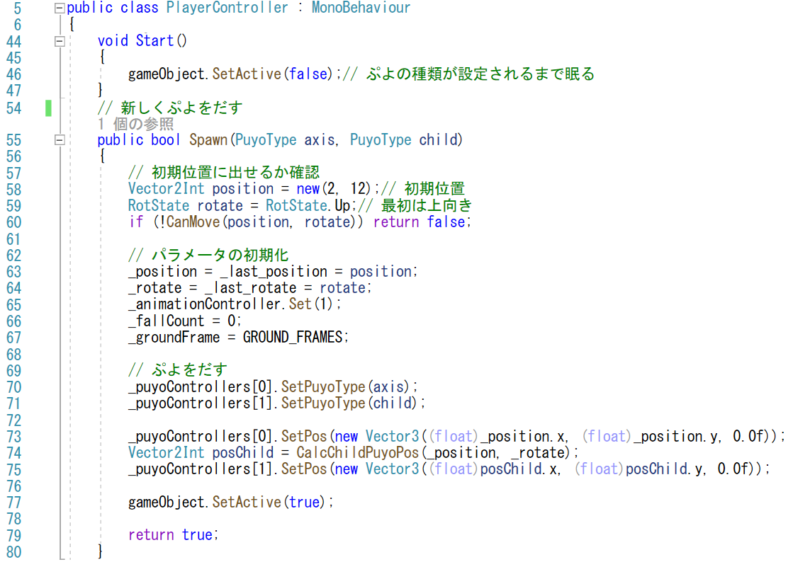

## 入力処理をプレイヤーから移動する

これで、ぷよが地面に固定された時に新しいぷよが出るようになったのですが、
このままではよくありません。
先ほど説明した方向キーを入れっぱなしにしておくと最初の段階から移動できるということが実現できません。
それは、Playerオブジェクトが非Activeになると、FixedUpdateが呼ばれなくないので、キー入力の処理が扱われないからです。
したがって、キー入力の処理をPlayerControllerからPlayDirector に移す必要があります。

### 入力データの受け渡し

まずは、キー入力のデータをPlayDirectorからPlayerControllerに渡せるようにします。
今までのコードでは、LogicalInputクラスのインスタンスをPlayerControllerに置いていましたが、
それをPlayDirectorに確保します(9行目)

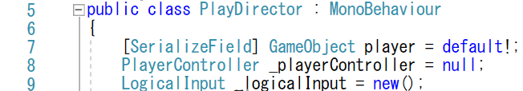

PlayerControllerでは、LogicalInputクラスの参照を受け取るSetLogicalInputメソッドを用意して、
PlayDirectorからLogicalInputクラスの情報を受け取る窓口を確保します(49-52行目)。

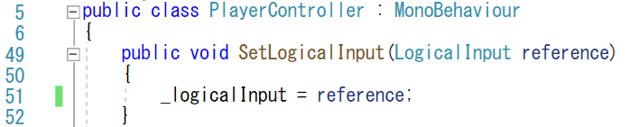

PlayDirectorでは、初期化時にLogicalInputクラスのインスタンスを初期化する(18行目)とともに、
PlayerControllerにインスタンスの情報を引き渡します(19行目)。

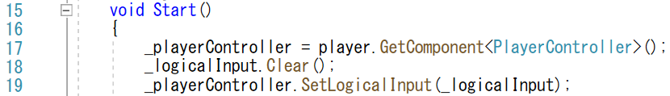

今回のメンバー編集の情報のやり取りですが、PlayDirectorクラスのメンバー変数_logicalInputを
publicにする方法もあります。
しかしながら、そうするとPlayerControllerがPlayDirectorに依存することになります。
PlayerControllerとPlayDirectorを比較すると、PlayDirectorの方が集約的な処理を行うので、好ましくありません。
SOLID原則の「依存性逆転の原則」を利用して抽象に依存させるのも良いですが、
今回は実装の容易さからPlayDirectorからPlayerControllerのメソッドを呼び出す形式としました。

### プレイヤースクリプトのメンバー名の変更

なお、前回までは、PlayerControllerのLogicalInputクラスのメンバーは、logicalInputとなっていましたが、
今回、_logicalInputに変更しました。
このような変数の置き換えはVisualStudioで簡単に行えます。
変更したい変数を選択した後に、右クリックでメニューをだすと、「名前の変更」という項目が出てくると思うので、
この項目を選択します。

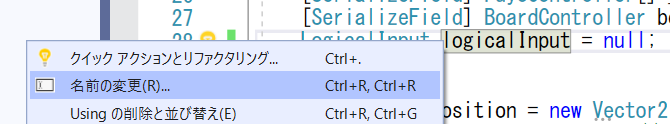

すると、ダイアログが表示されて、コメントや文字列を含めるのか選択することができません。
これらチェックボックスで条件を選択しながら変数を書き換えると、コード内で利用している変数の名前を
まとめて置き換えることができます。

例えば、下の画像では、28行目を変更したのですが、51行目も書きかわっています。

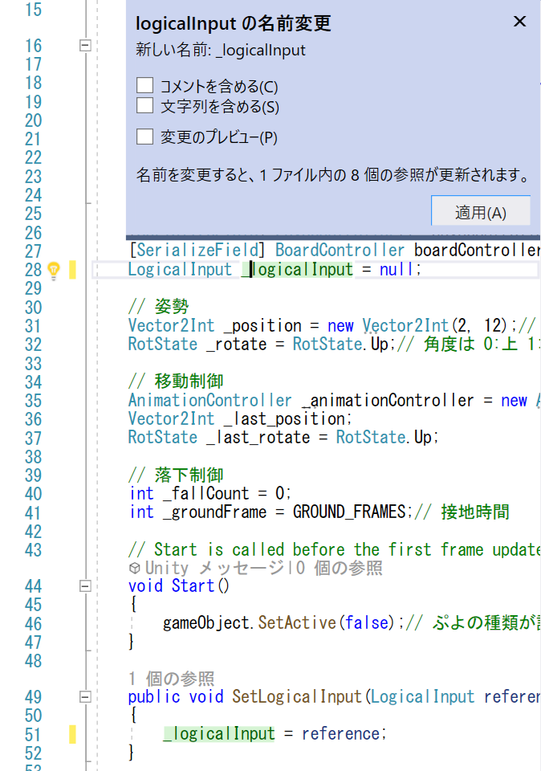

### 入力処理のコードの移動

また、PlayerControllerに置いていたUpdateInputメソッドをPlayDirectorクラスに移さなくてはなりません。

PlayDirectorクラスにUpdateInputメソッドをコピペ(43-57行目)して、FixedUpdateにUpdateInputメソッドの呼び出しを追加します(64行目)。

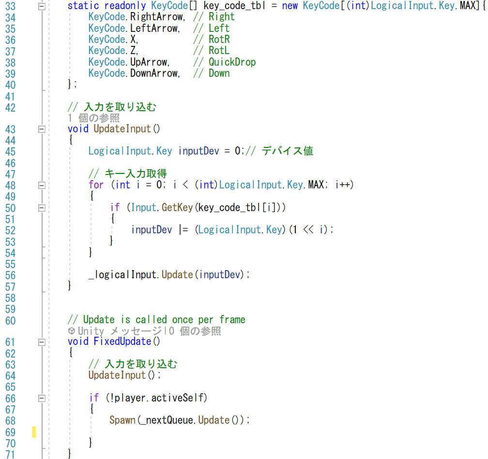

そして、PlayerControllerのFixedUpdateに記載されていたUpdateInputメソッドを削除します。
また、PlayerControllerのUpdateInputメソッド自体も削除しました。

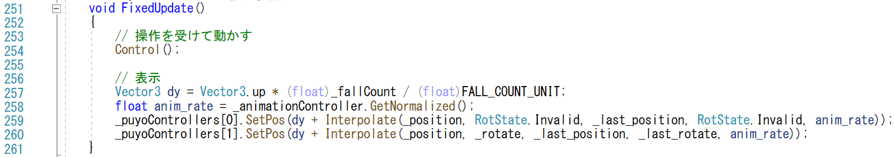

## NEXTぷよの色を変える

あとは、その次と次の次に落ちてくるぷよの色を変えましょう。

2つのぷよが組になっているので、これらをひとまとめにしてプレハブにするのが良さそうです。
「PuyoPair」という名前のEmptyObjectを作成します。
PuyoPairには、puyoプレハブを2つ追加しましょう。

また、「PuyoPair」という名前のC#スクリプトを用意して、このスプリプトから
ぷよの色を変えらるようにします。このスクリプトでやることは次の通りです。

- 2つのぷよオブジェクトにアクセスできるようにインスペクタからオブジェクトを登録できるようにする(7行目)
- 2つのぷよオブジェクトに種類を設定するSetPuyoTypeメソッドを追加する(9-13行目)

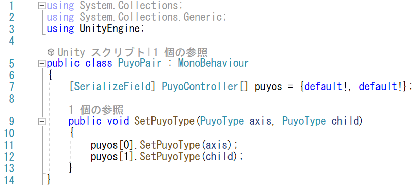

puyosメンバーにはインスペクターで2つのぷよのオブジェクトを指定します。
ここまでのPuyoPairオプジェクトをAssetsのPrefabsフォルダーにドラッグアンドドロップしてプレハブ化します。

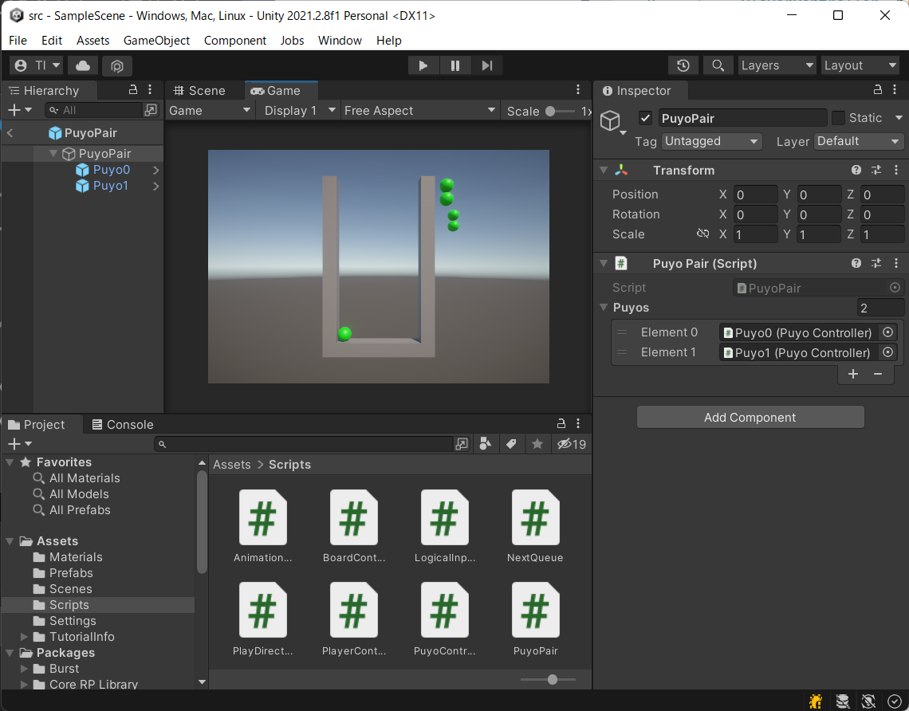

このPuyoPairプレハブをBoardゲームオブジェクトの子供として、ドラッグアンドドロップで2つ追加します。
名前は、「Next」と「NextNext」にしましょうか。

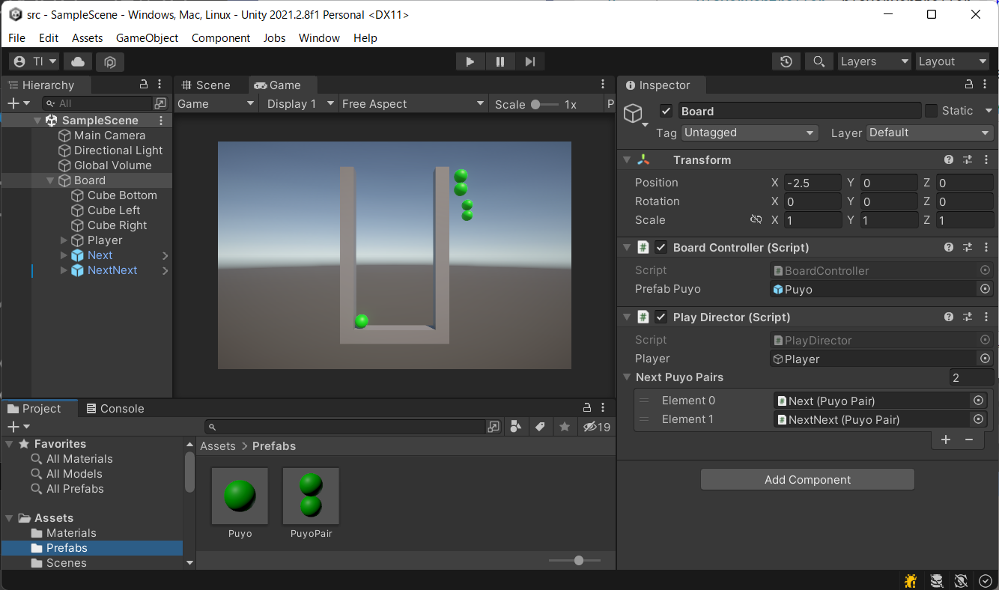

この2つのPuyoPairプレハブの制御は、PlayDirectorが行います。

- nextPuyoPairsのメンバー変数を導入して、スクリプトからNextとNextNextにアクセスできるようにする(12行目)
  - 上の図で、nextPuyoPairsには、NextとNextNextが登録されていることを確認できます
- NextとNextNextを更新するUpdateNextsViewメソッドを追加(26-30行目)
- Spawnメソッドの呼び出しの後に、UpdateNextsViewを呼び出し(23, 69行目)

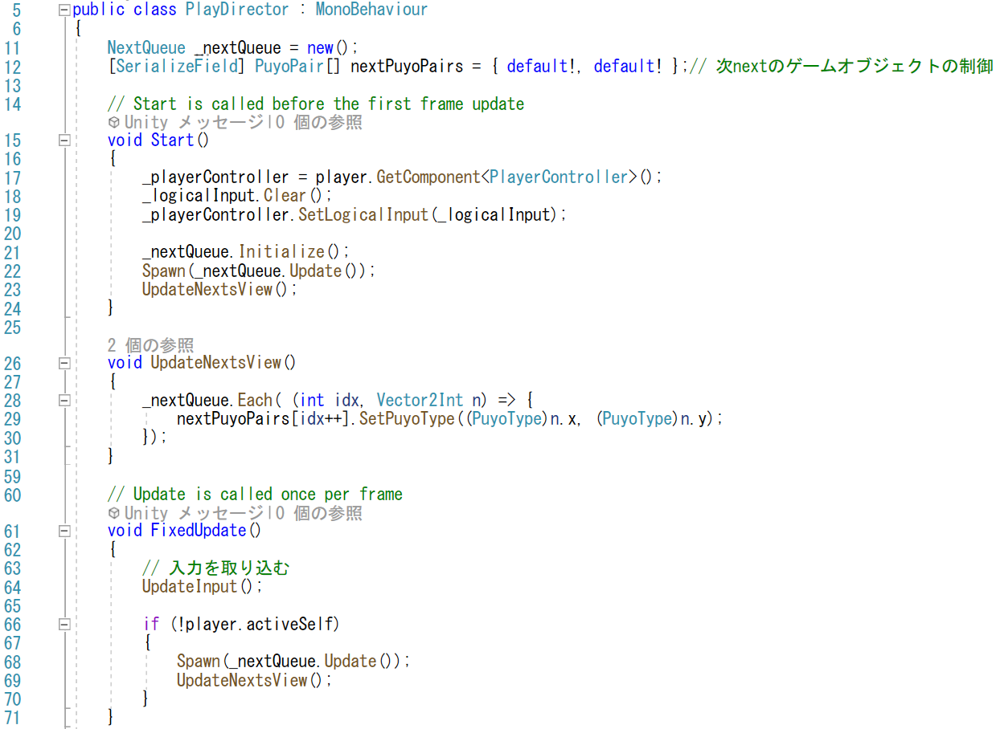

UpdateNextsViewでは、NextQueueにコールバック関数を受け取るEachメソッドを用意して(42-43行目)、
NextQueueに登録されているぷよの種類を順番に取得できるようにします。
コールバック関数は、PuyoDirectorでラムダ式で記述しました(上図28-30行目)

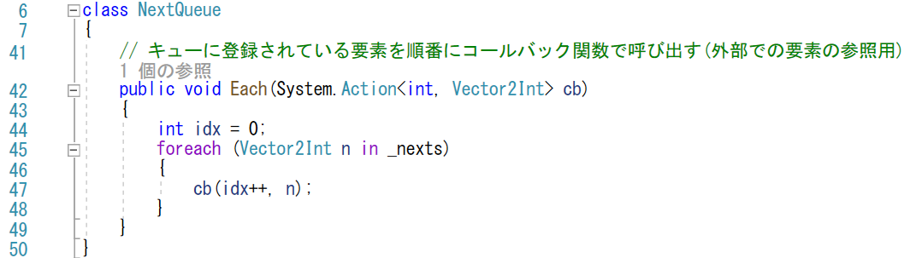

# 検証

ぷよが下に落ちたら、上からまた新しく落ちてきたら合格です。

# 最後に
今回は、ぷよぷよを何個も落とせるようにしました。
しかし、まだたくさんくっついても消えませんし、
高く積みあがってもゲームオーバーになりません。
現状では、高く積みあがると、ひたすら新しいものを
出そうとします。

ぷよぷよとして遊べるのはもう少し先になります。

https://user-images.githubusercontent.com/936545/153457031-7786981f-6378-43df-a1e6-de1ed23b52af.mp4

